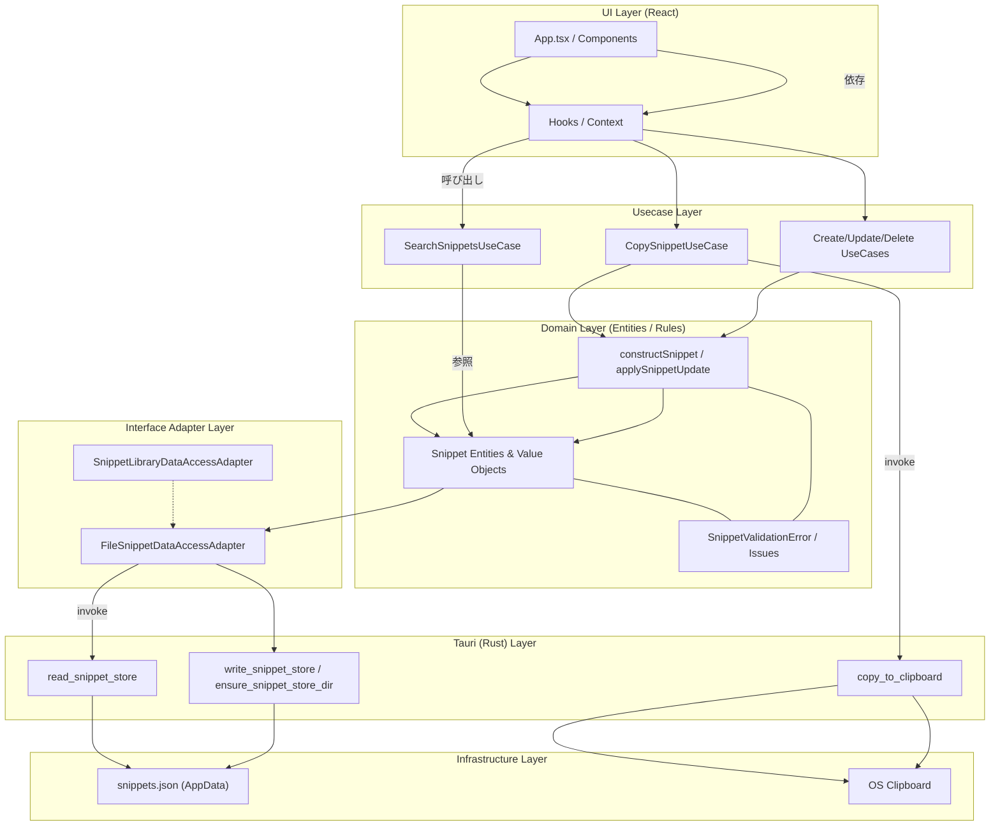

# アーキテクチャ図

Mermaid で表現した CodeSpark の主要レイヤとデータフロー。

## 読み方
- **UI → Usecase**: React からフックを介して各ユースケースを呼び出し、検索・コピー・CRUD を実行する。
- **Usecase → Domain**: ユースケースはドメインファクトリ（`constructSnippet` / `applySnippetUpdate`）を呼び、同じ層にある Validation/Errors とともにエンティティを検証・生成する。
- **Domain → DataAccess**: ドメインは `SnippetDataAccessAdapter` 経由で FileSnippetDataAccessAdapter を利用する。
- **DataAccess → Tauri**: アダプタは `invoke` で Tauri コマンド（JSON 読み書き・ディレクトリ作成）を呼び出し、OS ファイルへ委譲する。
- **Copy Usecase → Clipboard**: コピー用ユースケースは Tauri のクリップボードコマンドを呼んで OS クリップボードへ書き込む。

## 参考リンク
- [README](../README.md)
- [docs/design.md](./design.md)
